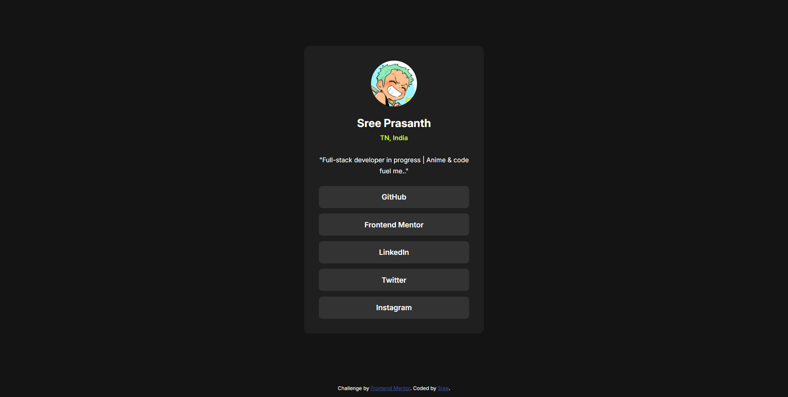

# Frontend Mentor - Social links profile solution

This is my solution to the [Social links profile challenge on Frontend Mentor](https://www.frontendmentor.io/challenges/social-links-profile-UG32l9m6dQ). It's a responsive profile card featuring social links, personalized with my details, and built with accessibility and mobile-first design in mind.

---

## Table of contents

- [Overview](#overview)
  - [The challenge](#the-challenge)
  - [Screenshot](#screenshot)
  - [Links](#links)
- [My process](#my-process)
  - [Built with](#built-with)
  - [What I learned](#what-i-learned)
  - [Continued development](#continued-development)
  - [Useful resources](#useful-resources)
- [Author](#author)
- [Acknowledgments](#acknowledgments)

---

## Overview

### The challenge

Users should be able to:

- View the optimal layout depending on their device screen size (mobile: 375px, desktop: 1440px).
- See hover and focus states for all interactive elements.
- Navigate the links using only their keyboard.
- Personalize the component with their own image, name, and links.

### Screenshot



### Links

- [Live Site](#)
- [Frontend Mentor Solution](https://www.frontendmentor.io/solutions/responsive-social-links-profile-with-accessibility-Kh2rmV7FZJ)

---

## My process

### Built with

- Semantic HTML5
- CSS Custom Properties
- Flexbox for layout
- Mobile-first approach
- Responsive design principles
- Accessible keyboard navigation
- `:focus-visible` and `outline` styling

### What I learned

This project helped reinforce key responsive and accessibility principles. I practiced:

- Creating keyboard-accessible buttons using `:focus-visible`.
- Building clean layouts using Flexbox.

```css
img.avatar {
  width: 96px;
  height: 96px;
  border-radius: 50%;
  object-fit: cover;
}

.social-btn:focus-visible {
  outline: 2px dashed hsl(75, 94%, 57%);
  outline-offset: 4px;
}
```

### Continued development

In future projects, I plan to:

- Add a dark mode toggle with user preference support.
- Explore using CSS Grid for more dynamic layouts.
- Improve accessibility further by using ARIA attributes where appropriate.
- Integrate animations with `@keyframes` and `transition` to enhance interactivity.

### Useful resources

- [CSS Tricks: A Complete Guide to Flexbox](https://css-tricks.com/snippets/css/a-guide-to-flexbox/) - Helped me align and space content responsively.
- [MDN Web Docs - Accessibility](https://developer.mozilla.org/en-US/docs/Web/Accessibility) - Great reference for making sites keyboard-accessible.

---

## Author

- GitHub – [@Imissh3r](https://github.com/Imissh3r)
- Frontend Mentor – [@Imissh3r](https://www.frontendmentor.io/profile/Imissh3r)

---

## Acknowledgments

Shoutout to the Frontend Mentor community and the MDN documentation for their continuous inspiration and guidance. 🙌
